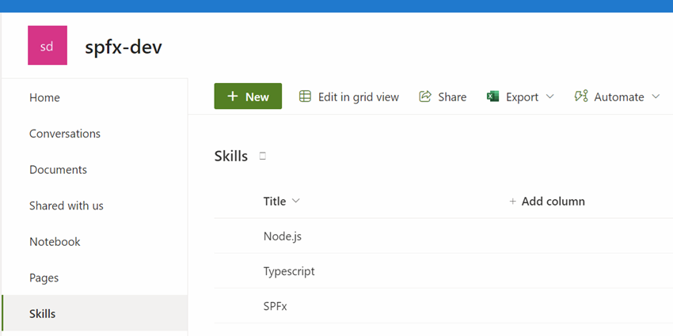

# SharePoint Framework using React

[Set up your SharePoint Framework development environment](https://learn.microsoft.com/en-us/sharepoint/dev/spfx/set-up-your-development-environment)

[SPFx development environment compatibility](https://learn.microsoft.com/en-us/sharepoint/dev/spfx/compatibility)

## Setup SPFx

Install dependencies

```bash
npm i -g gulp-cli yo @microsoft/generator-sharepoint
```

Create a new SPFx project

```bash
yo @microsoft/sharepoint
```

Trust self signed certificate

```bash
gulp trust-dev-cert
```

Create a SharePoint site collection and a skills list:




Update `config/serve.json` to reflect your SharePoint Site:

```json
{
  "$schema": "https://developer.microsoft.com/json-schemas/spfx-build/spfx-serve.schema.json",
  "port": 4321,
  "https": true,
  "initialPage": "https://integrationsonline.sharepoint.com/sites/spfx-dev/_layouts/workbench.aspx"
}

```

Run the project

```bash
gulp serve
```

## Labs

[Develop web parts with the SharePoint Framework](https://learn.microsoft.com/en-us/training/modules/sharepoint-spfx-web-parts/)