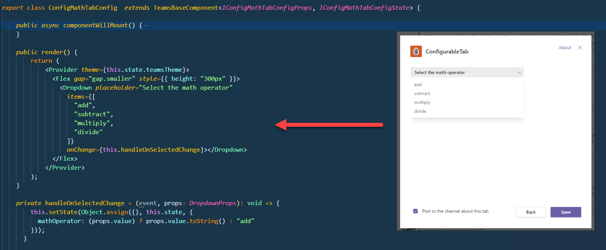

# Tabs

## Setup Teams

Install dependencies

```bash
npm i -g yo generator-teams
```

## Demo

-   Personal Tab
-   Configurable Tab

[What are Microsoft Teams tabs](https://docs.microsoft.com/en-us/microsoftteams/platform/tabs/what-are-tabs)

Configurable tab `ConfigMathTabConfig.tsx`:



## Labs

[Create embedded web experiences with tabs for Microsoft Teams](https://learn.microsoft.com/en-us/training/modules/embedded-web-experiences/)