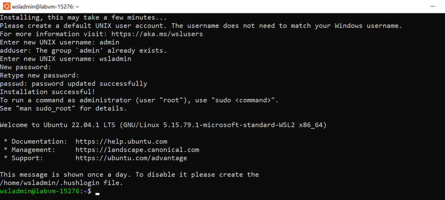

# Setup Windows Subsystem for Linux 2 - WSL2

>Note: Requires Windows 10 - May 2020 Update or higher. To Update use this [link](https://www.microsoft.com/de-de/software-download/windows10).

[Install WSL 2](https://docs.microsoft.com/en-us/windows/wsl/install) in a Powershell Prompt with administrative privileges:

```powershell
wsl --install
Restart-Computer
```

Finish installation of Ubuntu 20.04 LTS from the Microsoft Store and set wsl user and password:

```
user=labadmin
pwd=Lab@dmin1234
```



