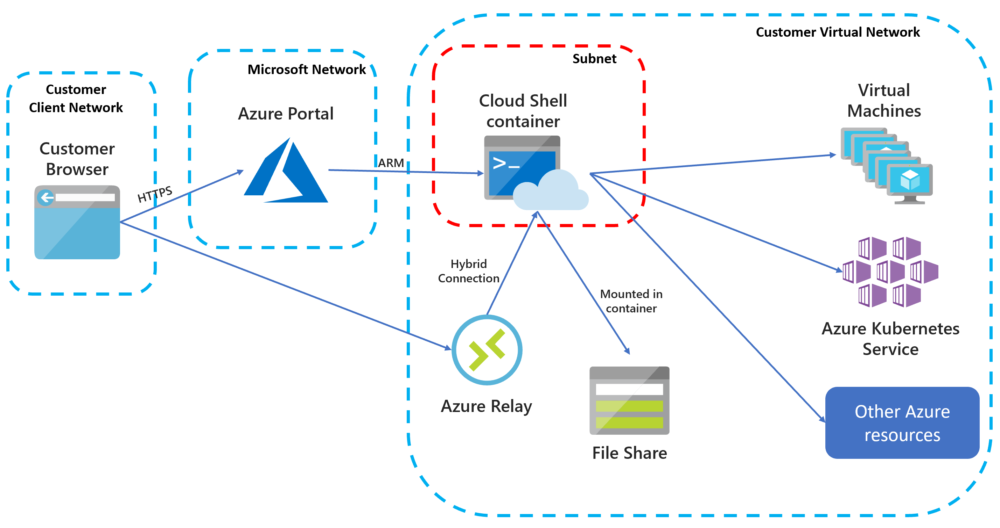
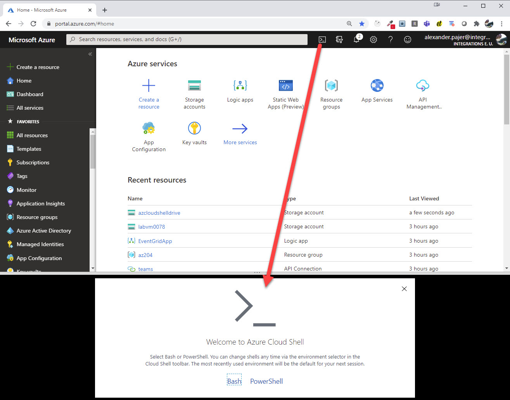
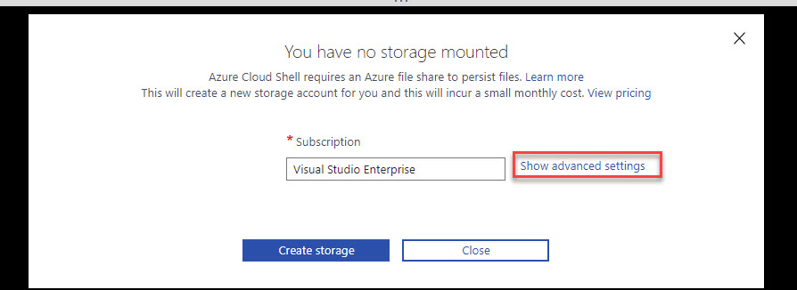
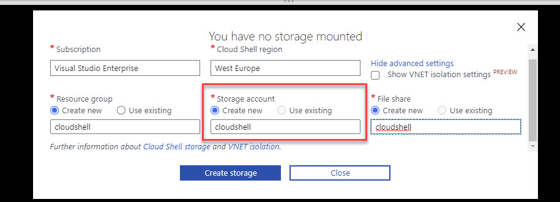

# Implement solutions that use virtual machines

## Azure CLI

[Azure CLI Reference](https://docs.microsoft.com/en-us/cli/azure/reference-index?view=azure-cli-latest)

[Azure CLI Query](https://docs.microsoft.com/en-us/cli/azure/query-azure-cli?view=azure-cli-latest)

[JMESPath Documentation](http://jmespath.org/)

## Extensions

[Azure Account](https://marketplace.visualstudio.com/items?itemName=ms-vscode.azure-account) and [Azure CLI Tools](https://marketplace.visualstudio.com/items?itemName=ms-vscode.azurecli) connect to [Azure Cloud Shell](https://docs.microsoft.com/en-us/azure/cloud-shell/overview#:~:text=Azure%20Cloud%20Shell%20is%20an,work%2C%20either%20Bash%20or%20PowerShell.&text=Direct%20link%3A%20Open%20a%20browser,%3A%2F%2Fshell.azure.com.)



## Install Azure CLI & CloudShell

### Configure CloudShell for first use

Open the Cloud Shell to configure it for first use:



Chose Bash and your subscription



Optional: Give a meaningfull name to your Clould Shell Storage using Advanced Settings:



> Note: To reset CloudShell you can use `Dismount-Clouddrive`

### Install Azure CLI

Install Azure CLI in an elevated PowerShell prompt:

```
Invoke-WebRequest -Uri https://aka.ms/installazurecliwindows -OutFile .\AzureCLI.msi; Start-Process msiexec.exe -Wait -ArgumentList '/I AzureCLI.msi /quiet'; rm .\AzureCLI.msi
```

> Note: To install Azure CLI in Linux (ie. WSL) execute `install-az-cli-linux.sh` from Setup/Linux folder

## Getting Started

Log In:

```bash
az login
```

Try at cmd - use ctrl + d to exit:

```
az interactive
```

> Note: You can also use: `F1 - Open Bash in Cloud Shell` using Azure Account Extension


List available extensions:

```bash
az extension list-available --output table
az extension add --name <extension-name>
```

Configure automatic installation of extensions:

```bash
az config set extension.use_dynamic_install=yes_without_prompt
```

Configure automatic updates:

```bash
az config set auto-upgrade.enable=yes
```

### CLI Examples

#### Create an App Service to host a Web App:

```bash
env=dev
loc=westeurope
grp=skillsapp-$env
acaenv=skill-$env
img='alexander-kastil/weather-api'

# create a resource group
az group create -n $grp -l $loc

# create a container apps environment
az containerapp env create -n $acaenv -g $grp -l $loc

# create a container apps service
az containerapp create -n $apiApp-$env -g $grp --image $img --environment $acaenv --target-port 80 --ingress external
```

### Troubleshoot CLI

Select Directory:

https://shell.azure.com/

In my case issue resolved by reverting Azure Account extension version to 0.8.11.

## Additional Labs & Walkthroughs

[Control Azure services with the CLI](https://docs.microsoft.com/en-us/learn/modules/control-azure-services-with-cli/)
